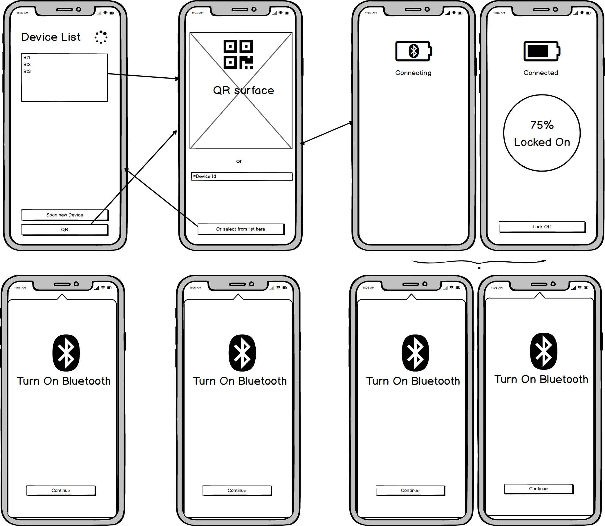

This is sample of controlling relay on Bluetooth (BT Device) https://ncd.io/bluetooth-relays/, from android.

Feature:

- list available bluetooth device (open/paired)
- connect to device based on list or QR scanner
- relay switcher to on/off

Additional feature:

- BT discovering (paired, new device)
- BT connection event (on, off, disconnect, reconnect)
- Device event (Relay state, device state) 

Page:

- main device list
- QR scanner
- relay control

